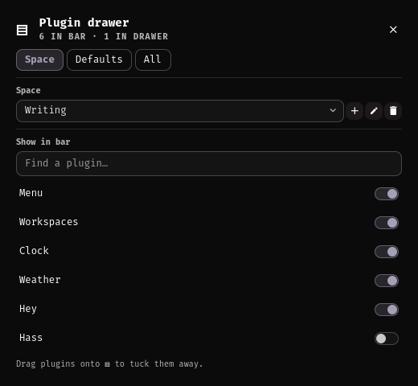

# Omarchy Drawer

Keep a few plugins in the bar and tuck the rest into a drawer. Save different selections for Writing, Music, a client project, or whatever you are working on.

- Drag a plugin onto **▤** to move it into the drawer. Drag it back to the bar to show it again.
- Open **▤** to use tucked-away widgets and choose what appears in the bar.
- Click **◉** beside the drawer for **Defaults**: only your configured `omarchy.*` widgets remain in the bar. Click **↶** to restore the previous view.
- **All** temporarily reveals all configured widgets. Click it again, or choose **Space**, to restore the saved selection.
- **Global** starts with your current arrangement. Create named **spaces** to save independent visibility choices. These are task profiles, separate from Hyprland workspaces.

Hiding a widget preserves its configuration, bar position, running instance, and services. Visibility applies to every instance of a plugin ID. The drawer itself stays visible. New plugins appear in your current space until you tuck them away.

The panel uses Omarchy's shared controls and theme: a compact space selector, inline space actions, and searchable **Show in bar** switches. Click a plugin row or focus it with Tab and press Space to change its visibility. The view buttons and space selector also support keyboard navigation.



## Requirements and installation

This is an experimental plugin for the Quickshell-based Omarchy shell. It requires the included stock-bar drawer extension: the existing plugin API does not expose stock bar drag events. The extension keeps the built-in bar and its normal per-widget service capabilities.

Use an Omarchy **development checkout**, not the package-owned `/usr/share/omarchy` directory. The extension is based on Omarchy commit `82652c8bdba65c05954fe6ebd961d90029250a5d`; the installer checks that the patch applies before changing anything.

```sh
git clone https://github.com/spencerbull/omarchy-drawer.git
cd omarchy-drawer
./scripts/apply-host-extension "$OMARCHY_PATH"
omarchy plugin add "$PWD" --enable --yes
omarchy restart shell
```

Review the host changes in `integration/` before applying them. Future Omarchy updates may require rebasing the extension. Installing only the plugin does not enable dragging; its tooltip reports that the extension is missing.

The drawer stores its spaces and visibility in its own entry in `~/.config/omarchy/shell.json`, using Omarchy's settings writer. It does not disable other plugins or write their settings. Defaults filters the plugins you already configured; it does not install or enable absent stock widgets.

## Spaces

A new space copies the selected space's saved visibility. Changes save immediately. Switching spaces restores their selection. Global cannot be removed. Removing another space preserves plugins and switches back to Global if necessary.

Changing visibility while viewing Defaults or All makes that visible selection the active space's new configuration. Merely toggling those views leaves the saved configuration untouched.

## Commands

```sh
omarchy-shell spencerbull.drawer open
omarchy-shell spencerbull.drawer close
omarchy-shell spencerbull.drawer defaults  # toggle Defaults / previous view
omarchy-shell spencerbull.drawer all
omarchy-shell spencerbull.drawer restore   # saved active space
```

Right-click the drawer button to toggle Show all / saved space.

## Development

```sh
node --test tests/model.test.cjs
omarchy plugin validate "$PWD"
./scripts/test-qml
integration/test-apply.sh "$OMARCHY_PATH"
./scripts/test-native  # briefly runs a fixture bar on the current Wayland session
```

The QML test uses the installed Omarchy components in an offscreen fixture, exercises space and mode changes, and renders normal and narrow layouts into `.artifacts/`. The native fixture separately exercises pointer dragging, service-backed widget identity, center-anchor visibility, popup handoff, closed input masks, and original ordering. Set `DRAWER_POSITION=top`, `bottom`, `left`, or `right` to test an orientation.

MIT licensed. Host integration changes derive from Omarchy; its license is retained alongside the patch.
